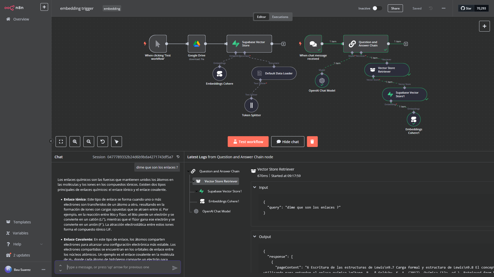

# n8n Embedding & Q&A Workflow

This n8n workflow automates the process of downloading a PDF from Google Drive, generating multilingual embeddings using Cohere, and storing them in a Supabase vector store. It also features a chat-based question-and-answer system powered by xAI's Grok model.

## Description

The workflow downloads "Química - Raymond Chang - 12va Edición.pdf" from Google Drive, splits the text into chunks, generates embeddings with the `embed-multilingual-v2.0` model from Cohere, and stores them in a Supabase vector database. A chat trigger enables question-answering using the `grok-2-1212` model from xAI, retrieving relevant context from the vector store.

## Features

- Downloads files from Google Drive.
- Generates embeddings with Cohere (`embed-multilingual-v2.0`).
- Stores embeddings in Supabase vector store.
- Chat-based Q&A with xAI (`grok-2-1212`).
- Configurable chunk size for text splitting (default: 3000).

## Prerequisites

- n8n instance with required nodes installed.
- Credentials for:
  - Google Drive OAuth2 API.
  - Cohere API.
  - Supabase API.
  - xAI API (Grok).

## Setup

1. Import the workflow JSON into your n8n instance.
2. Configure the credentials for Google Drive, Cohere, Supabase, and xAI in the respective nodes.
3. Adjust the `Token Splitter` chunk size if needed (default: 3000).
4. Activate the workflow and test it using the "Test workflow" trigger or chat input.

## Usage

- Trigger manually to process the PDF and store embeddings.
- Use the chat interface to ask questions based on the document content.

# Flujo de Trabajo de Embedding y Q&A con n8n

Este flujo de trabajo de n8n automatiza la descarga de un PDF desde Google Drive, la generación de embeddings multilingües con Cohere y su almacenamiento en un almacén vectorial de Supabase. También incluye un sistema de preguntas y respuestas basado en chat, impulsado por el modelo Grok de xAI.

## Descripción

El flujo descarga "Química - Raymond Chang - 12va Edición.pdf" desde Google Drive, divide el texto en fragmentos, genera embeddings con el modelo `embed-multilingual-v2.0` de Cohere y los almacena en una base de datos vectorial de Supabase. Un desencadenador de chat permite responder preguntas usando el modelo `grok-2-1212` de xAI, recuperando contexto relevante del almacén vectorial.

## Características

- Descarga archivos desde Google Drive.
- Genera embeddings con Cohere (`embed-multilingual-v2.0`).
- Almacena embeddings en un vector store de Supabase.
- Sistema de Q&A por chat con xAI (`grok-2-1212`).
- Tamaño de fragmentos configurable (predeterminado: 3000).

## Requisitos Previos

- Instancia de n8n con los nodos necesarios instalados.
- Credenciales para:
  - Google Drive OAuth2 API.
  - Cohere API.
  - Supabase API.
  - xAI API (Grok).

## Configuración

1. Importa el JSON del flujo de trabajo en tu instancia de n8n.
2. Configura las credenciales para Google Drive, Cohere, Supabase y xAI en los nodos correspondientes.
3. Ajusta el tamaño de fragmentos en el `Token Splitter` si es necesario (predeterminado: 3000).
4. Activa el flujo y pruébalo con el desencadenador "Test workflow" o la entrada de chat.

## Uso

- Activa manualmente para procesar el PDF y almacenar embeddings.
- Usa la interfaz de chat para hacer preguntas basadas en el contenido del documento.

## Licencia

Licencia MIT - siéntete libre de usar, modificar y distribuir.